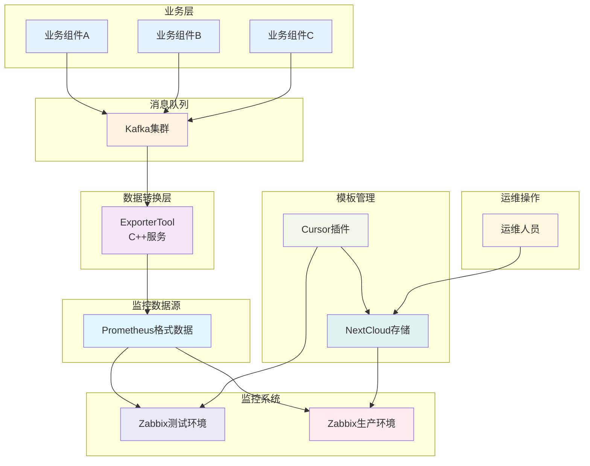
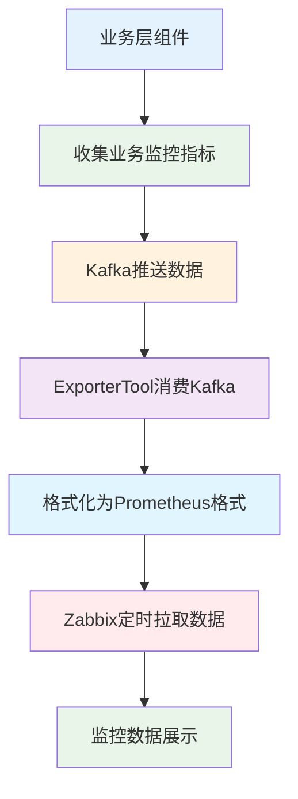

# 业务监控接入说明

本文档说明如何接入业务监控系统，包含监控数据生产和监控项模板维护两个核心部分。

## 📋 目录

- [🚀 快速开始](#-快速开始)
- [📊 系统架构](#-系统架构)
- [📝 监控数据生产](#-监控数据生产)
- [🔧 模板管理](#-模板管理)
- [✅ 验证部署](#-验证部署)
- [❓ 常见问题](#-常见问题)
- [📚 文档资源](#-文档资源)

---

## 🚀 快速开始

### 5分钟快速接入

1. **配置插件**：安装并配置Cursor插件
2. **创建配置**：创建业务监控项配置文件
3. **发布模板**：一键发布到测试环境
4. **验证数据**：检查监控数据是否正常

> 💡 **新手推荐**：首次使用建议先阅读[模板管理](#-模板管理)部分了解基本概念

---

## 📊 系统架构

### 整体架构图



### 核心组件说明

| 组件 | 职责 | 技术栈 |
|------|------|--------|
| **业务组件** | 收集业务监控指标数据 | Java/其他 |
| **Kafka集群** | 消息队列，存储监控数据 | Kafka |
| **ExporterTool** | 数据转换服务 | C++ |
| **Zabbix** | 监控数据存储和展示 | Zabbix |
| **Cursor插件** | 模板管理工具 | TypeScript |
| **NextCloud** | 模板存储 | NextCloud |

---

## 📝 监控数据生产

### 监控数据生产流程



### 数据生产流程说明

1. **数据收集**：各业务组件收集业务相关的监控指标数据
2. **消息推送**：通过Kafka将监控数据推送到消息队列（Topic: `starry_exporter_business_monitor`）
3. **数据转换**：C++ ExporterTool消费Kafka数据，进行格式转换、过滤和聚合
4. **格式标准化**：将数据格式化为Prometheus可识别的标准格式
5. **数据采集**：Zabbix定时拉取Prometheus格式的监控数据
6. **数据展示**：在Zabbix中展示监控图表和触发告警

### Kafka数据结构定义

业务组件通过Kafka推送的监控指标数据到Topic `starry_exporter_business_monitor`，数据格式遵循以下JSON结构：

```json
{
  "t": "stebm", // 消息类型 type, [非必须], 对于同一个主题消息包含多种子类消息时使用
  "st": 1702039699371, // 毫秒级时间戳 (GMT+0) sendTime, [必须], 用于发送延迟排查
  "rid": "", // 消息唯一id recordId, [非必须], 字符串格式, 默认建议使用雪花算法id (该topic唯一), 幂等使用
  "tid": "", // 链路id traceId, [非必须], 上下文中获取, 如果接入skywalk等链接追踪从skywalk中获取, 都没有使用uuid
  "v": "1.0", // 版本标识 version, [必须], 示例: 1.0, 2.0
  "ext": "", // 扩展数据 extendMap, [非必须], 数据透传
  "data": { // 业务数据
    "i": "s17", // industry (行业层标识, 必填)
    "m": "djms", // module (服务组件, 必填)
    "n": "alarmEvidenceDownload", // domain (业务领域, 长度限制32个字符, 驼峰标识, 必填)
    "u": "times", // unit (单位, 非必填)
    "t": 1702039699371, // time (采集数据的毫秒级时间戳, 必填)
    "e": "COUNTER", // type (指标类型, 必填)
    "d": [ // data (指标数据, 必填), data的数据集大小应该有边界限制
      {
        "l": { // 指标标签, 必填, label格式: <label name>: <label value>), 指标名与值采驼峰形式
          "source": "10.0.0.1", // 指标数据来源的内网IP (必填)
          "tenantId": 1, // 租户ID (非必填)
          "appId": 10001, // 应用ID (非必填)
          "taskStatus": "success" // 表示指标数据为成功任务
        },
        "v": 10 // value 监控指标值 (必填) 比如, 当前labels代表为证据下载成功量
      },
      {
        "l": {
          "source": "10.0.0.1",
          "tenantId": 1,
          "appId": 10001,
          "taskStatus": "fail" // 表示指标数据为失败任务
        },
        "v": 5 // value 监控指标值 (必填) 比如, 前labels代表为证据下载失败量
      }
    ]
  }
}
```

### 数据结构说明

#### 消息头字段

| 字段 | 类型 | 必填 | 说明 |
|------|------|------|------|
| `t` (type) | String | 否 | 消息类型，用于区分同一主题下的不同消息 |
| `st` (sendTime) | Long | 是 | 消息发送的毫秒级时间戳，用于追踪消息延迟 |
| `rid` (recordId) | String | 否 | 消息唯一标识符，建议使用雪花算法生成，确保幂等性 |
| `tid` (traceId) | String | 否 | 链路追踪ID，用于在分布式系统中追踪请求 |
| `v` (version) | String | 是 | 消息版本号，如 "1.0", "2.0" |
| `ext` (extendMap) | HashMap | 否 | 扩展字段，用于透传额外数据 |

#### 业务数据字段

| 字段 | 类型 | 必填 | 说明 |
|------|------|------|------|
| `i` (industry) | String | 是 | 行业层标识，如 "s17" |
| `m` (module) | String | 是 | 服务组件名称，如 "djms" |
| `n` (domain) | String | 是 | 业务领域，长度限制32个字符，驼峰标识 |
| `u` (unit) | String | 否 | 监控指标单位，如 "times" |
| `t` (time) | Long | 是 | 指标数据采集的毫秒级时间戳 |
| `e` (type) | String | 是 | 指标类型，基于Prometheus核心数据类型定义 |
| `d` (data) | Array | 是 | 指标数据数组，每个元素代表一个指标样本 |

#### 指标类型说明

`e` (type) 字段是指标数据采集类型，基于Prometheus核心数据类型定义。在统一的业务监控设计中应该有对应的枚举类定义和统一维护。

**常用指标类型枚举：**

```java
/**
 * 指标类型枚举
 */
public enum MetricType {
    /**
     * 计数器 - 单调递增的累计值，如请求总数、错误总数
     */
    COUNTER,
    
    /**
     * 计量器 - 可增可减的瞬时值，如CPU使用率、内存使用量
     */
    GAUGE,
    
    /**
     * 直方图 - 观察值的分布统计，如请求延迟分布
     */
    HISTOGRAM,
    
    /**
     * 摘要 - 观察值的分位数统计，如请求延迟的P50、P95、P99
     */
    SUMMARY
}
```

**使用场景：**
- **COUNTER**：适用于累计计数场景，如API调用次数、错误次数
- **GAUGE**：适用于瞬时值场景，如当前连接数、CPU使用率
- **HISTOGRAM**：适用于分布统计场景，如请求延迟分布、响应大小分布
- **SUMMARY**：适用于分位数统计场景，如请求延迟的百分位数

#### 指标样本字段

| 字段 | 类型 | 必填 | 说明 |
|------|------|------|------|
| `l` | HashMap | 是 | 指标标签集合，键值对形式，用于描述指标的维度 |
| `v` (value) | Number | 是 | 监控指标的具体数值 |

#### 常用标签字段

| 标签 | 类型 | 必填 | 说明 |
|------|------|------|------|
| `source` | String | 是 | 指标数据来源的内网IP |
| `tenantId` | Integer | 否 | 租户ID |
| `appId` | Integer | 否 | 应用ID |
| `taskStatus` | String | 否 | 任务状态，如 "success" 或 "fail" |

### 监控数据生产相关组件

| 组件 | 职责 | 技术栈 | 输出 |
|------|------|--------|------|
| **业务组件** | 收集业务监控指标数据，推送到Kafka Topic | Java/其他 | Kafka消息（Topic: `starry_exporter_business_monitor`） |
| **ExporterTool (S17的组件)** | 消费Kafka数据，格式化为Prometheus格式 | C++ | Prometheus格式数据 |
| **Zabbix Agent** | 部署在业务主机上，用于Zabbix服务器采集监控数据。**注意：当前不支持CICD部署，需要联系运维人员部署** | Zabbix Agent | 主机监控数据 |
| **Zabbix** | 定时拉取监控数据，存储和展示 | Zabbix | 监控图表和告警 |

### ExporterTool服务部署

ExporterTool服务支持集群部署，通过CICD自动部署，负责消费Kafka中的监控数据并转换为Prometheus格式。

#### 资源规格

| 资源类型 | 推荐配置 | 说明 |
|----------|----------|------|
| **内存** | 100MB | 单节点推荐内存配置 |
| **CPU** | 0.3C | 单节点推荐CPU配置 |
| **部署模式** | 集群部署 | 支持多实例部署，提高可用性和性能 |

#### 部署说明

- **部署方式**：通过CICD自动部署
- **服务发现**：支持服务发现和负载均衡
- **高可用**：集群部署确保服务高可用性
- **弹性伸缩**：支持根据负载自动扩缩容

## 🔧 模板管理

### 合并模板架构

本系统采用**合并模板架构**，解决Zabbix模板依赖冲突问题：

#### 模板组成
- `master_prometheus_business_template` - **主监控项模板**（运维维护）
- `{serviceName}_business_template.properties` - **业务监控项配置**（开发维护）
- `merged_business_template.xml` - **合并模板**（系统自动生成）

### 快速开始

#### 步骤1：配置Cursor插件

**安装**：Cursor → `Ctrl/Cmd + Shift + X` → 搜索 "Zabbix Template Publisher"

**配置**：`Ctrl + ,` → 搜索 "Zabbix Template Publisher"

必填项：
- NextCloud URL: `https://your-nextcloud.com`
- Username: 登录用户名
- Password: 应用专用密码（[创建方法](doc/troubleshooting.md#q1-如何获取nextcloud应用专用密码)）

可选项：
- WebDAV Username: WebDAV文件空间用户名（如与登录用户名不同）
- Template Base Path: 默认 `/云平台开发部/监控模板`

Zabbix配置（可选，用于自动导入测试环境）：
- Zabbix URL: `https://your-zabbix.com/zabbix`
- Zabbix Username: Zabbix用户名
- Zabbix Password: Zabbix密码

#### 配置参数详解

| 配置项 | 类型 | 必填 | 默认值 | 说明 |
|--------|------|------|--------|------|
| **NextCloud配置** |
| `nextcloud.url` | String | 是 | - | NextCloud服务器地址 |
| `nextcloud.username` | String | 是 | - | NextCloud用户名 |
| `nextcloud.password` | String | 是 | - | NextCloud应用专用密码 |
| `nextcloud.templateBasePath` | String | 否 | `/云平台开发部/监控模板` | 模板存储根路径 |
| `nextcloud.webdavUsername` | String | 否 | - | WebDAV文件空间用户名（如果与登录用户名不同）|
| **Zabbix配置** |
| `zabbix.url` | String | 否 | - | Zabbix服务器地址 |
| `zabbix.username` | String | 否 | - | Zabbix用户名 |
| `zabbix.password` | String | 否 | - | Zabbix密码 |

**注意事项**：
- SSL证书验证已自动禁用，支持自签名证书
- 超时时间固定为30秒
- Zabbix配置是可选的，如不配置则只上传到NextCloud，不导入到Zabbix
- 配置修改后需要重启Cursor才能生效
- 建议使用应用专用密码而非登录密码，提高安全性

#### 步骤2：创建业务监控项配置文件

在 `src/main/resources/zabbix/` 创建业务监控项配置文件：`{serviceName}_business_template.properties`

> 📝 **文件命名规则**：
> - 文件名格式：`{serviceName}_business_template.properties`
> - `{serviceName}` 从项目的 `pom.xml` 文件中读取 `<artifactId>` 标签值
> - 如果项目没有 `pom.xml` 文件，需要手动指定服务名称


**主监控项模板配置（运维维护）**：

> 📖 完整配置说明请参考：[示例文件](doc/examples/master_prometheus_business_template.properties)
> 
> 💡 **重要说明**：主监控项模板由运维人员统一维护，各组件无需创建，仅作为参考了解依赖关系。

**业务监控项配置（各组件维护）**：

> 📖 完整配置说明请参考：[示例文件说明](doc/examples/README.md)
> - [告警服务示例](doc/examples/base_alarm_service_business_template.properties)
> - [网关服务示例](doc/examples/base_gateway_service_business_template.properties)  
> - [服务器服务示例](doc/examples/base_server_service_business_template.properties)

> 💡 **配置说明**：
> - **主监控项**：由运维人员统一维护，各组件无需创建
> - **业务监控项**：各组件需要创建和维护
> - **依赖关系**：所有业务监控项通过 `master_item` 引用主监控项：`master.prometheus[{$EXPORTTOOL_URL}]`
> - **静态监控项**：适合固定指标（如系统总量、健康状态）
> - **发现规则**：适合多维度场景（如多租户、多应用），配置一次自动适配

#### 步骤3：发布模板

##### 🎯 合并模板发布方案

**发布流程**：
```
开发 → 修改.properties → 🔧 开发测试 → 验证通过 → 🚀 生产发布
```

##### 🔧 开发测试环境

**操作**：右键 `.properties` 文件 → `🔧 开发测试 - 生成合并模板` → `自动导入到测试Zabbix环境`

**验证功能**：
- ✅ 自动生成本地模板XML
- ✅ 自动拉取其他组件Release模板
- ✅ 自动合并所有模板
- ✅ 自动导入到测试Zabbix环境（模板名称：merged_business_template_dev）

##### 🚀 生产发布环境

**操作**：右键 `.properties` 文件 → `🚀 生产发布 - 发布合并模板`

**发布功能**：
- ✅ 上传模板到 `zabbix_template_release/`
- ✅ 拉取所有Release模板
- ✅ 自动合并模板
- ✅ 上传合并模板到 `zabbix_template_release/merged/`
- ✅ 模板名称：merged_business_template

##### 📁 支持的文件格式

- **`.properties`**：自动转换为XML（推荐）
- **`.xml`**：直接上传使用

##### 💡 使用建议

1. **开发流程**：先🔧开发测试验证，通过后🚀生产发布
2. **团队分工**：
   - **运维**：维护主监控项模板到NextCloud
   - **开发**：维护业务监控项`.properties`文件

## ✅ 验证部署

### 开发环境验证

**验证流程**：步骤3已自动完成模板导入，需要手动完成以下验证步骤

#### 1. 手动绑定测试主机

**操作步骤**：
1. **登录Zabbix测试环境**
   - 访问Zabbix测试环境URL
   - 使用测试账号登录

2. **找到目标主机**
   - 进入 `配置` → `主机`
   - 搜索并选择需要绑定的测试主机

3. **链接合并模板**
   - 点击主机名称进入编辑页面
   - 切换到 `模板` 标签页
   - 在"链接新模板"输入框中搜索并选择：`merged_business_template_dev`
   - 点击 `添加` → `更新` 保存配置

#### 2. 验证监控数据

**验证步骤**：
1. **等待数据采集**
   - 等待5-10分钟让Zabbix采集数据

2. **检查监控项数据**
   - 进入 `监测` → `最新数据`
   - 选择对应主机，查看监控项是否有数据
   - 检查发现规则是否自动创建了监控项原型

3. **验证告警规则**
   - 进入 `配置` → `主机` → 选择主机 → `触发器`
   - 确认告警规则已正确创建

### 生产环境部署

**运维操作**：生产环境需要运维人员手动部署

**部署步骤**：
1. **下载合并模板**：从NextCloud `zabbix_template_release/merged/` 下载 `merged_business_template.xml`
2. **导入到生产Zabbix**：登录生产环境Zabbix，导入模板
3. **链接到主机**：在主机配置中链接 `merged_business_template`
4. **验证数据**：等待5-10分钟，检查 `监测` → `最新数据`

## ❓ 常见问题

### 开发环境问题
- **测试失败**：检查`.properties`文件配置
- **无数据**：检查ExporterTool服务状态
- **绑定失败**：检查主机配置和网络连通性

### 生产环境问题
- **导入失败**：检查XML格式和Zabbix版本兼容性
- **链接失败**：确认模板已正确导入
- **数据异常**：检查网络连通性和服务状态

### 配置问题
- **NextCloud连接失败**：检查URL、用户名、密码是否正确
- **Zabbix导入失败**：检查Zabbix配置和权限
- **模板合并失败**：检查所有依赖模板是否存在于NextCloud中

> 📖 **详细故障排查指南**：[故障排查与常见问题](doc/troubleshooting.md)

---

## 📚 文档资源

- [合并模板使用指南](doc/merged-template-guide.md) - 合并模板功能完整说明
- [故障排查与常见问题](doc/troubleshooting.md) - 错误诊断、解决方案、FAQ
- [示例文件](doc/examples/) - 完整的配置示例和模板文件

---

## 📋 版本信息

**文档版本**: V2.0  
**最后更新**: 2025-01-22  

### V2.0 核心特性
- 🔄 **合并模板架构**：解决Zabbix模板依赖冲突问题
- 🔧 **Dev/Release工作流**：开发测试与生产发布完全隔离
- 🤖 **自动模板合并**：智能合并多个模板为单一模板
- 📦 **NextCloud集成**：自动拉取和上传模板文件
- ⚡ **零依赖冲突**：合并模板无依赖关系，可正常链接到主机
- ✅ **零学习成本**：开发人员无需关注主监控项细节