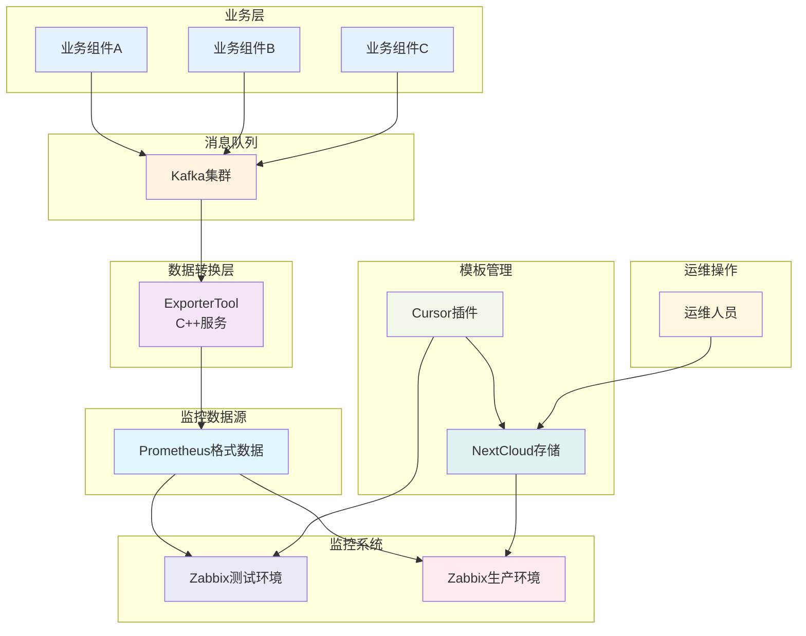
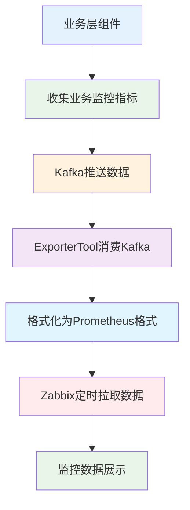

# 业务监控接入说明

本文档说明如何接入业务监控系统，包含监控数据生产和监控项模板维护两个核心部分。

## 系统架构图




## 第一部分：监控数据生产

### 监控数据生产流程



### 数据生产流程说明

1. **数据收集**：各业务组件收集业务相关的监控指标数据
2. **消息推送**：通过Kafka将监控数据推送到消息队列（Topic: `starry_exporter_business_monitor`）
3. **数据转换**：C++ ExporterTool消费Kafka数据，进行格式转换、过滤和聚合
4. **格式标准化**：将数据格式化为Prometheus可识别的标准格式
5. **数据采集**：Zabbix定时拉取Prometheus格式的监控数据
6. **数据展示**：在Zabbix中展示监控图表和触发告警

### Kafka数据结构定义

业务组件通过Kafka推送的监控指标数据到Topic `starry_exporter_business_monitor`，数据格式遵循以下JSON结构：

```json
{
  "t": "stebm", // 消息类型 type, [非必须], 对于同一个主题消息包含多种子类消息时使用
  "st": 1702039699371, // 毫秒级时间戳 (GMT+0) sendTime, [必须], 用于发送延迟排查
  "rid": "", // 消息唯一id recordId, [非必须], 字符串格式, 默认建议使用雪花算法id (该topic唯一), 幂等使用
  "tid": "", // 链路id traceId, [非必须], 上下文中获取, 如果接入skywalk等链接追踪从skywalk中获取, 都没有使用uuid
  "v": "1.0", // 版本标识 version, [必须], 示例: 1.0, 2.0
  "ext": "", // 扩展数据 extendMap, [非必须], 数据透传
  "data": { // 业务数据
    "i": "s17", // industry (行业层标识, 必填)
    "m": "djms", // module (服务组件, 必填)
    "n": "alarmEvidenceDownload", // domain (业务领域, 长度限制32个字符, 驼峰标识, 必填)
    "u": "times", // unit (单位, 非必填)
    "t": 1702039699371, // time (采集数据的毫秒级时间戳, 必填)
    "e": "COUNTER", // type (指标类型, 必填)
    "d": [ // data (指标数据, 必填), data的数据集大小应该有边界限制
      {
        "l": { // 指标标签, 必填, label格式: <label name>: <label value>), 指标名与值采驼峰形式
          "source": "10.0.0.1", // 指标数据来源的内网IP (必填)
          "tenantId": 1, // 租户ID (非必填)
          "appId": 10001, // 应用ID (非必填)
          "taskStatus": "success" // 表示指标数据为成功任务
        },
        "v": 10 // value 监控指标值 (必填) 比如, 当前labels代表为证据下载成功量
      },
      {
        "l": {
          "source": "10.0.0.1",
          "tenantId": 1,
          "appId": 10001,
          "taskStatus": "fail" // 表示指标数据为失败任务
        },
        "v": 5 // value 监控指标值 (必填) 比如, 前labels代表为证据下载失败量
      }
    ]
  }
}
```

### 数据结构说明

#### 消息头字段

| 字段 | 类型 | 必填 | 说明 |
|------|------|------|------|
| `t` (type) | String | 否 | 消息类型，用于区分同一主题下的不同消息 |
| `st` (sendTime) | Long | 是 | 消息发送的毫秒级时间戳，用于追踪消息延迟 |
| `rid` (recordId) | String | 否 | 消息唯一标识符，建议使用雪花算法生成，确保幂等性 |
| `tid` (traceId) | String | 否 | 链路追踪ID，用于在分布式系统中追踪请求 |
| `v` (version) | String | 是 | 消息版本号，如 "1.0", "2.0" |
| `ext` (extendMap) | HashMap | 否 | 扩展字段，用于透传额外数据 |

#### 业务数据字段

| 字段 | 类型 | 必填 | 说明 |
|------|------|------|------|
| `i` (industry) | String | 是 | 行业层标识，如 "s17" |
| `m` (module) | String | 是 | 服务组件名称，如 "djms" |
| `n` (domain) | String | 是 | 业务领域，长度限制32个字符，驼峰标识 |
| `u` (unit) | String | 否 | 监控指标单位，如 "times" |
| `t` (time) | Long | 是 | 指标数据采集的毫秒级时间戳 |
| `e` (type) | String | 是 | 指标类型，基于Prometheus核心数据类型定义 |
| `d` (data) | Array | 是 | 指标数据数组，每个元素代表一个指标样本 |

#### 指标类型说明

`e` (type) 字段是指标数据采集类型，基于Prometheus核心数据类型定义。在统一的业务监控设计中应该有对应的枚举类定义和统一维护。

**常用指标类型枚举：**

```java
/**
 * 指标类型枚举
 */
public enum MetricType {
    /**
     * 计数器 - 单调递增的累计值，如请求总数、错误总数
     */
    COUNTER,
    
    /**
     * 计量器 - 可增可减的瞬时值，如CPU使用率、内存使用量
     */
    GAUGE,
    
    /**
     * 直方图 - 观察值的分布统计，如请求延迟分布
     */
    HISTOGRAM,
    
    /**
     * 摘要 - 观察值的分位数统计，如请求延迟的P50、P95、P99
     */
    SUMMARY
}
```

**使用场景：**
- **COUNTER**：适用于累计计数场景，如API调用次数、错误次数
- **GAUGE**：适用于瞬时值场景，如当前连接数、CPU使用率
- **HISTOGRAM**：适用于分布统计场景，如请求延迟分布、响应大小分布
- **SUMMARY**：适用于分位数统计场景，如请求延迟的百分位数

#### 指标样本字段

| 字段 | 类型 | 必填 | 说明 |
|------|------|------|------|
| `l` | HashMap | 是 | 指标标签集合，键值对形式，用于描述指标的维度 |
| `v` (value) | Number | 是 | 监控指标的具体数值 |

#### 常用标签字段

| 标签 | 类型 | 必填 | 说明 |
|------|------|------|------|
| `source` | String | 是 | 指标数据来源的内网IP |
| `tenantId` | Integer | 否 | 租户ID |
| `appId` | Integer | 否 | 应用ID |
| `taskStatus` | String | 否 | 任务状态，如 "success" 或 "fail" |

### 监控数据生产相关组件

| 组件 | 职责 | 技术栈 | 输出 |
|------|------|--------|------|
| **业务组件** | 收集业务监控指标数据，推送到Kafka Topic | Java/其他 | Kafka消息（Topic: `starry_exporter_business_monitor`） |
| **ExporterTool (S17的组件)** | 消费Kafka数据，格式化为Prometheus格式 | C++ | Prometheus格式数据 |
| **Zabbix Agent** | 部署在业务主机上，用于Zabbix服务器采集监控数据。**注意：当前不支持CICD部署，需要联系运维人员部署** | Zabbix Agent | 主机监控数据 |
| **Zabbix** | 定时拉取监控数据，存储和展示 | Zabbix | 监控图表和告警 |

### ExporterTool服务部署

ExporterTool服务支持集群部署，通过CICD自动部署，负责消费Kafka中的监控数据并转换为Prometheus格式。

#### 资源规格

| 资源类型 | 推荐配置 | 说明 |
|----------|----------|------|
| **内存** | 100MB | 单节点推荐内存配置 |
| **CPU** | 0.3C | 单节点推荐CPU配置 |
| **部署模式** | 集群部署 | 支持多实例部署，提高可用性和性能 |

#### 部署说明

- **部署方式**：通过CICD自动部署
- **服务发现**：支持服务发现和负载均衡
- **高可用**：集群部署确保服务高可用性
- **弹性伸缩**：支持根据负载自动扩缩容

## 第二部分：监控项模板维护

### 架构说明

本系统采用**主从分离架构**，将主监控项和业务监控项分工维护：

- `master_prometheus_business_template` - **主监控项配置**（由运维管理人员统一维护到NextCloud、Zabbix）
- `{serviceName}_business_template.properties` - **业务监控项配置**（各组件项目维护）

**核心机制**：
- **运维统一管理**：主监控项由运维人员提前维护到NextCloud、Zabbix，各组件无需维护
- **组件独立开发**：各组件只需创建和维护业务监控项配置文件
- **模板依赖关系**：业务模板通过 `master_item` 引用主监控项
- **Zabbix智能导入**：插件自动检测主监控项是否存在，已存在则覆盖更新

**核心优势**：
- ✅ 分工明确：运维管理主监控项，开发维护业务监控项
- ✅ 零学习成本：各组件无需关注主监控项细节
- ✅ 标准化配置：主监控项统一管理，避免不一致

### 快速开始

#### 步骤1：配置Cursor插件

**安装**：Cursor → `Ctrl/Cmd + Shift + X` → 搜索 "Zabbix Template Publisher"

**配置**：`Ctrl + ,` → 搜索 "Zabbix Template Publisher"

必填项：
- NextCloud URL: `https://your-nextcloud.com`
- Username: 登录用户名
- Password: 应用专用密码（[创建方法](doc/cursor-plugin-guide.md#nextcloud配置)）

可选项：
- WebDAV Username: WebDAV文件空间用户名（[如何获取](doc/troubleshooting.md#2-nextcloud认证失败)，如与登录用户名不同）
- Version: 留空则自动从 pom.xml 读取
- Template Base Path: 默认 `/云平台开发部/监控模板`

Zabbix配置（可选，用于自动导入测试环境）：
- Zabbix URL: `https://your-zabbix.com/zabbix`
- Zabbix Username: Zabbix用户名
- Zabbix Password: Zabbix密码

#### 步骤2：创建业务监控项配置文件

> 💡 **重要说明**：主监控项模板由运维管理人员统一维护到NextCloud、Zabbix，各组件项目中**无需创建**主监控项配置文件。

在 `src/main/resources/zabbix/` 创建业务监控项配置文件：

**文件：`{serviceName}_business_template.properties`**

> 📋 **主监控项模板参考**：以下主监控项配置由运维人员维护，各组件无需创建，仅作为参考了解依赖关系。

**主监控项模板配置（运维维护）**：

```properties
# 主监控项模板 - 所有组件使用相同的配置
# 文件名：master_prometheus_business_template.properties（由运维人员维护）

# 模板基本信息
zabbix.template="master_prometheus_business_template"
zabbix.template.name="master_prometheus_business_template"
zabbix.template.version="5.0"

# 模板组信息
zabbix.groups[0].name="business_monitor"

# 应用信息
zabbix.applications[0].name="Prometheus"

# 宏定义
zabbix.macros[0].macro="{$EXPORTTOOL_URL}"
zabbix.macros[0].value="127.0.0.1:21746"
zabbix.macros[0].description="ExporterTool接口URL"

# 主监控项（唯一的Prometheus数据拉取入口）
zabbix.items[0].name="master-prometheus-metadata"
zabbix.items[0].key="master.prometheus[{$EXPORTTOOL_URL}]"
zabbix.items[0].type="ZABBIX_ACTIVE"
zabbix.items[0].value_type="TEXT"
zabbix.items[0].delay="5m"
zabbix.items[0].history="30d"
zabbix.items[0].trends="0"
zabbix.items[0].appName="Prometheus"
```

**业务监控项配置（各组件维护）**：

> 📖 完整配置说明请参考：[配置参数参考手册](doc/configuration-reference.md) | [示例文件](doc/examples/base_alarm_service_business_template.properties)

```properties
# 业务监控项模板配置（示例）
# 文件名：{serviceName}_business_template.properties（serviceName自动从pom.xml读取）

# 模板基本信息
zabbix.template="base_alarm_service_business_template"
zabbix.template.name="base_alarm_service_business_template"
zabbix.template.version="5.0"

# 模板组信息
zabbix.groups[0].name="business_monitor"

# 应用信息
zabbix.applications[0].name="base_alarm_service"

# 模板依赖（关键：声明依赖主监控项模板）
zabbix.templates[0].name="master_prometheus_business_template"

# 业务监控项配置
# 更新管理员信息调度任务 - 监控更新管理员信息的定时任务执行情况
# name 和 key 对应 Kafka 消息中的 n (domain) 字段：业务领域标识
zabbix.items[0].name="ft_manager_app_update_admin_info_scheduler_task"
zabbix.items[0].key="ft_manager_app_update_admin_info_scheduler_task"
zabbix.items[0].type="DEPENDENT"
zabbix.items[0].value_type="FLOAT"
zabbix.items[0].delay="0"
# 关键：引用主监控项（来自master_prometheus_business_template.properties）
zabbix.items[0].master_item="master.prometheus[{$EXPORTTOOL_URL}]"
zabbix.items[0].preprocessing_type="PROMETHEUS_PATTERN"
zabbix.items[0].preprocessing_params="ft_manager_app_update_admin_info_scheduler_task{}"
zabbix.items[0].appName="base_alarm_service"

# 发现规则配置
# DCS业务信息发现规则 - 自动发现DCS(Distributed Control System)业务信息指标
# 用于监控不同应用、租户、类别的业务数据，支持动态发现和监控
zabbix.discovery_rules[0].name="s17_dcs_dcsBusinessInfo"
zabbix.discovery_rules[0].key="s17_dcs_dcsBusinessInfo.discovery"
zabbix.discovery_rules[0].type="DEPENDENT"
zabbix.discovery_rules[0].delay="0"
zabbix.discovery_rules[0].lifetime="3d"
# 同样引用主监控项
zabbix.discovery_rules[0].master_item="master.prometheus[{$EXPORTTOOL_URL}]"
zabbix.discovery_rules[0].preprocessing_type="PROMETHEUS_TO_JSON"
zabbix.discovery_rules[0].preprocessing_params="s17_dcs_dcsBusinessInfo{}"
# lld_macros 对应 Kafka 消息中的 l (label) 字段：指标标签，用于多维度监控
zabbix.discovery_rules[0].lld_macros="APPID,CATEGORY,METRIC_NAME,SOURCE,TENANTID"
zabbix.discovery_rules[0].appName="base_alarm_service"
# item_prototype配置
zabbix.discovery_rules[0].item_prototype.name="s17_dcs_dcsBusinessInfo:[{#CATEGORY}] [appId:{#APPID}] [tenantId:{#TENANTID}]"
zabbix.discovery_rules[0].item_prototype.key="s17_dcs_dcsBusinessInfo[{#CATEGORY},{#APPID},{#TENANTID}]"
```

> 💡 **配置说明**：
> - **主监控项**：由运维人员统一维护，各组件无需创建，已存在于Zabbix中
> - **业务监控项**：各组件需要创建和维护，文件名 `{serviceName}` 从 pom.xml 自动读取
> - **依赖关系**：所有业务监控项通过 `master_item` 引用主监控项：`master.prometheus[{$EXPORTTOOL_URL}]`
> - **静态监控项**：适合固定指标（如系统总量、健康状态）
> - **发现规则**：适合多维度场景（如多租户、多应用），配置一次自动适配
> - **模板依赖**：业务模板通过 `zabbix.templates[0].name="master_prometheus_business_template"` 声明依赖

#### 步骤3：发布模板

**发布方式**：
- 命令面板：`Cmd/Ctrl + Shift + P` → "Publish Zabbix Template"
- 右键菜单：右键配置文件 → 选择发布
- 快捷键：`Cmd/Ctrl + Shift + Z`

**支持的文件格式**：
- **`.properties` 文件**：自动转换为XML格式后上传
- **`.xml` 文件**：直接上传，无需转换

**自动执行流程**：

**Properties文件流程**：
1. 读取业务监控项配置文件（`.properties`）
2. 转换为 `.xml` 模板文件
3. 上传到 NextCloud
4. 自动创建缺失的主机组（如需要）🆕
5. 导入到 Zabbix 测试环境（如已配置）

**XML文件流程**：
1. 直接读取XML模板文件
2. 提取模板名称用于Zabbix导入
3. 直接上传到 NextCloud
4. 自动创建缺失的主机组（如需要）🆕
5. 导入到 Zabbix 测试环境（如已配置）

> 💡 **工作分工**：
> - **运维人员**：负责维护主监控项模板到NextCloud
> - **开发人员**：只需维护业务监控项 `.properties` 文件，插件自动处理转换、上传、导入

#### 步骤4：联系运维链接模板

**开发环境（测试）**：

插件会自动导入模板到Zabbix测试环境，开发人员需要手动绑定主机进行验证：

1. **登录Zabbix测试环境**
   - 访问Zabbix测试环境URL
   - 使用测试账号登录

2. **找到目标主机**
   - 进入 `配置` → `主机`
   - 搜索并选择需要绑定的主机（通常是服务部署的主机）

3. **链接监控模板**
   - 点击主机名称进入编辑页面
   - 切换到 `模板` 标签页
   - 在"链接新模板"输入框中搜索并选择以下模板：
     - `master_prometheus_business_template`（主监控项，首次必须链接）
     - `{serviceName}_business_template`（业务监控项）
   - 点击 `添加` → `更新` 保存配置

4. **验证数据采集**
   - 等待5-10分钟让Zabbix采集数据
   - 进入 `监测` → `最新数据`
   - 选择对应主机，查看监控项是否有数据
   - 检查发现规则是否自动创建了监控项原型

**生产环境（正式部署）**：

1. 联系运维人员，提供模板名称：`{serviceName}_business_template`
2. 运维人员从NextCloud下载模板并导入生产环境
3. 运维人员在主机上链接以下模板：
   - `master_prometheus_business_template`（主监控项，首次必须链接）
   - `{serviceName}_business_template`（业务监控项）
4. 验证数据：`监测` → `最新数据`（等待5-10分钟）

> 💡 **提示**：
> - 主监控项模板由运维统一管理，只需链接一次
> - 每个组件的业务模板独立链接
> - 模板名称与配置文件中的 `zabbix.template.name` 对应
> - 开发环境可以自行绑定主机测试，生产环境需联系运维操作

## 文档资源

- [Cursor插件使用指南](doc/cursor-plugin-guide.md) - 插件安装、配置、使用详解
- [配置参数参考](doc/configuration-reference.md) - 完整配置参数说明
- [常见问题FAQ](doc/faq.md) - 高频问题解答、最佳实践
- [故障排查指南](doc/troubleshooting.md) - 错误诊断、解决方案

---

**文档版本**: V3.0  
**最后更新**: 2025-10-18  

**V3.0 核心特性**：
- 📁 主从分离架构：运维管理主监控项，开发维护业务监控项
- 🤖 插件智能处理：自动识别依赖关系，支持两种模式
- 📦 零协调成本：各业务团队完全独立维护业务监控项
- ✅ 零学习成本：开发人员无需关注主监控项细节