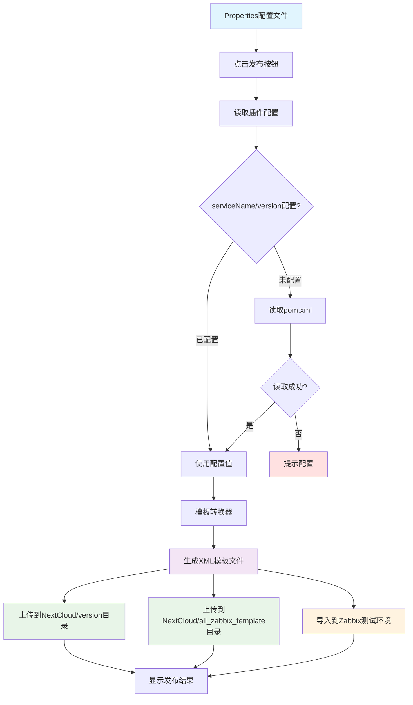

# Cursor插件使用指南

## 插件介绍

Zabbix模板发布Cursor插件，用于在编辑器中一键将`.properties`配置文件转换为Zabbix监控模板XML文件，并自动上传到NextCloud和导入Zabbix。serviceName自动从项目的pom.xml读取。

### 核心功能

- 🔄 **配置文件转换**：Properties → Zabbix XML模板
- ☁️ **自动上传NextCloud**：生成文件自动上传到NextCloud指定目录
- 🚀 **自动导入Zabbix**：模板自动导入到测试环境
- 📁 **版本管理**：支持all_zabbix_template和version两个目录结构
- 🖱️ **编辑器内操作**：在Cursor中一键发布，无需切换终端
- ⚙️ **智能配置**：自动从pom.xml读取serviceName(artifactId)和version
- 🔐 **安全认证**：支持NextCloud应用专用密码

### 工作流程



## 安装插件

### 方式一：从Cursor扩展市场安装（推荐）

1. 打开 Cursor
2. 按 `Ctrl/Cmd + Shift + X` 打开扩展面板
3. 搜索 "Zabbix Template Publisher"
4. 点击 "Install"

### 方式二：从命令行安装

```bash
cursor --install-extension your-publisher.zabbix-template-publish-plugin
```

## 配置插件

```
Ctrl + , → 搜索 "Zabbix Template Publisher"

必填项：
- NextCloud URL: https://your-nextcloud.com
- Username: your-username
- Password: xxxxx-xxxxx-xxxxx-xxxxx-xxxxx  ← 使用应用专用密码！

可选项：
- Template Base Path: 默认 /云平台开发部/监控模板（可自定义）
- Version: 留空则从 pom.xml 读取 ${project.version}
- WebDAV文件空间用户名: your-username_1234  ← 如果与登录用户名不同

注意：serviceName自动从pom.xml的artifactId读取，无需配置

Zabbix配置（可选，用于自动导入）：
- Zabbix Server URL: https://zabbix.streamax.com:8200/zabbix
- Zabbix Username: your-zabbix-username
- Zabbix Password: your-zabbix-password
- Zabbix Timeout: 30
- Skip SSL Verification: true
```

## 发布模板

### 方式1：使用命令面板（推荐）

1. 在Cursor中打开 `.properties` 或 `.xml` 文件
2. 按 `Cmd/Ctrl + Shift + P` 打开命令面板
3. 输入 "Publish Zabbix Template"
4. 回车执行

> 💡 **支持的文件格式**：
> - **`.properties` 文件**：自动转换为XML格式后上传
> - **`.xml` 文件**：直接上传，无需转换

### 方式2：使用右键菜单

1. 在文件树中右键点击 `.properties` 或 `.xml` 文件
2. 选择 "Publish Zabbix Template"

### 方式3：使用快捷键

- Mac: `Cmd + Shift + Z`
- Windows/Linux: `Ctrl + Shift + Z`

（需要在Cursor中打开 `.properties` 或 `.xml` 文件）

## 发布过程示例

### Properties文件发布示例

```
[Publishing] Reading configuration...
[Publishing] Service Name: base_alarm_service (from pom.xml)
[Publishing] Version: 2.16.11-SNAPSHOT (from pom.xml)
[Publishing] Processing configuration files...
[Publishing] Converting properties to XML...
[Publishing] ✓ Generated XML: base_alarm_service_business_template.xml (2.5KB)
[Publishing] Uploading to NextCloud:/云平台开发部/监控模板/2.16.11-SNAPSHOT/
[Publishing] ✓ Uploaded: base_alarm_service_business_template.xml
[Publishing] Uploading to NextCloud:/云平台开发部/监控模板/all_zabbix_template/
[Publishing] ✓ Uploaded: base_alarm_service_business_template.xml
[Publishing] Creating share links...
[Publishing] Importing to Zabbix test environment...
[Success] ✓ Template published successfully!
[Success] ✓ NextCloud: /云平台开发部/监控模板/all_zabbix_template/base_alarm_service_business_template.xml
```

### XML文件发布示例

```
[Publishing] Reading configuration...
[Publishing] Service Name: base_alarm_service (from pom.xml)
[Publishing] Version: 2.16.11-SNAPSHOT (from pom.xml)
[Publishing] Processing configuration files...
[Publishing] Detected XML file, reading content directly
[Publishing] ✓ Read XML file: base_alarm_service_business_template.xml (2.5KB)
[Publishing] Uploading to NextCloud:/云平台开发部/监控模板/2.16.11-SNAPSHOT/
[Publishing] ✓ Uploaded: base_alarm_service_business_template.xml
[Publishing] Uploading to NextCloud:/云平台开发部/监控模板/all_zabbix_template/
[Publishing] ✓ Uploaded: base_alarm_service_business_template.xml
[Publishing] Creating share links...
[Publishing] Importing to Zabbix test environment...
[Success] ✓ Template published successfully!
[Success] ✓ NextCloud: /云平台开发部/监控模板/all_zabbix_template/base_alarm_service_business_template.xml
```

> 💡 **说明**：主监控项模板由运维人员统一维护，各组件发布时无需上传主监控项

## NextCloud存储结构

插件会自动在NextCloud中创建以下目录结构：

```
/云平台开发部/监控模板/
├── {version}/              # 按版本存储（如：2.16.11-SNAPSHOT）
│   ├── {serviceName}_business_template.properties
│   └── {serviceName}_business_template.xml
└── all_zabbix_template/    # 最新全量模板
    ├── master_prometheus_business_template.xml (由运维维护)
    ├── {serviceName}_business_template.properties
    └── {serviceName}_business_template.xml
```

**目录说明**：
- **版本目录**：保留各组件历史版本，支持版本回溯
- **all_zabbix_template目录**：存储最新版本，运维人员从此下载生产部署
- **主监控项**：由运维人员统一维护到NextCloud，各组件无需上传

## 使用技巧

### 技巧1：验证插件配置正确

在发布模板前，建议先测试连接：

```
1. 按 Cmd/Ctrl + Shift + P 打开命令面板
2. 输入 "Zabbix Template Publisher: Test Connection"
3. 查看连接测试结果
```

插件会测试：
- NextCloud连接状态
- Zabbix连接状态
- pom.xml读取状态
- 配置完整性验证

### 技巧2：查看发布历史

Cursor插件会在输出面板显示详细日志：

1. 打开输出面板：`Cmd/Ctrl + Shift + U`
2. 选择 "Zabbix Template Publisher" 通道
3. 查看发布历史和详细日志

### 技巧3：更新已发布的模板

如果需要更新已发布的模板：

1. 修改 `.properties` 文件
2. 再次执行发布命令
3. 插件会自动覆盖NextCloud上的文件
4. Zabbix测试环境的模板也会自动更新

### 技巧4：在Cursor中快速编辑模板

推荐的工作流程：

1. 在Cursor中打开 `src/main/resources/zabbix/` 目录
2. 编辑模板配置文件（`.properties` 或 `.xml`）
3. 使用Cursor的智能提示和代码补全
4. 修改完成后按快捷键发布
5. 查看输出面板确认发布结果

