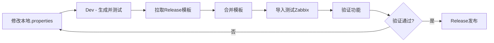
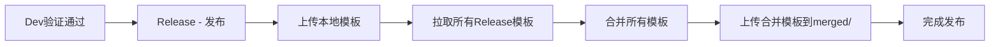

# 合并模板功能使用指南

## 📋 功能概述

合并模板功能用于解决Zabbix模板依赖冲突问题，特别是当多个业务模板依赖同一个主模板时，Zabbix会报错："模板不能重复链接到其它模板，即使透过其它模板"。

**核心思路**：将多个独立的业务监控模板（包括主监控项模板）合并为一个统一的监控模板，消除依赖关系。

---

## 🎯 解决的问题

### 问题场景

当你有以下模板结构时：
```
master_prometheus_business_template (主监控项)
    ↑
    |-- base_alarm_service_business_template (告警服务)
    |-- base_server_service_business_template (服务器服务)
    |-- base_gateway_service_business_template (网关服务)
```

在Zabbix中同时链接多个依赖主模板的业务模板时会报错。

### 解决方案

使用合并模板功能，自动将所有模板合并为一个：
```
merged_business_template (合并模板)
    - 包含主监控项的所有配置
    - 包含alarm服务的所有监控项和发现规则
    - 包含server服务的所有监控项和发现规则
    - 包含gateway服务的所有监控项和发现规则
```

---

## 🔄 工作流程

### Dev环境（开发测试）



**步骤说明**：

1. **开发人员修改本地模板**
   - 编辑 `.properties` 配置文件
   - 添加或修改监控项、发现规则

2. **右键执行 Dev 命令**
   - 右键点击 `.properties` 文件
   - 选择 `🔧 开发测试 - 生成合并模板`

3. **自动执行流程**
   - ✅ 解析本地 `.properties` 文件，生成XML模板
   - ✅ 连接NextCloud，从 `zabbix_template_release/` 拉取其他组件的Release模板
   - ✅ 自动合并本地模板 + Release模板
   - ✅ 生成合并模板（命名为 `merged_business_template_dev`）
   - ✅ 导入到测试Zabbix环境

4. **验证功能**
   - 登录Zabbix测试环境
   - 检查监控项是否有数据
   - 验证发现规则是否正常工作

**特点**：
- ⚠️ **不上传到NextCloud**
- ⚠️ **不影响生产环境**
- ✅ **快速验证**
- ✅ **可重复执行**

---

### Release环境（正式发布）



**步骤说明**：

1. **确认Dev环境验证通过**
   - 确保所有功能在测试环境正常工作
   - 确认监控数据正确

2. **右键执行 Release 命令**
   - 右键点击 `.properties` 文件
   - 选择 `🚀 生产发布 - 发布合并模板`
   - 确认发布操作

3. **自动执行流程**
   - ✅ 解析本地 `.properties` 文件，生成XML模板
   - ✅ 上传本地模板到 `zabbix_template_release/` 目录（覆盖旧版本）
   - ✅ 从 `zabbix_template_release/` 拉取所有Release模板（包括刚上传的）
   - ✅ 自动合并所有Release模板
   - ✅ 生成合并模板（命名为 `merged_business_template`）
   - ✅ 上传合并模板到 `zabbix_template_release/merged/` 目录

4. **生产环境使用**
   - 运维人员从NextCloud下载合并模板
   - 导入到生产Zabbix环境
   - 在主机上链接合并模板

**特点**：
- ✅ **正式发布**
- ✅ **更新生产环境**
- ✅ **自动生成合并模板**
- ✅ **版本控制**

---

## 📂 NextCloud目录结构

```
/云平台开发部/监控模板/
└── zabbix_template_release/                    # Release环境目录
    ├── master_prometheus_business_template.xml # 主监控项模板
    ├── base_alarm_service_business_template.xml # Alarm服务模板
    ├── base_server_service_business_template.xml # Server服务模板
    ├── base_gateway_service_business_template.xml # Gateway服务模板
    └── merged/                                  # 合并模板目录
        └── merged_business_template.xml         # 合并后的模板
```

**说明**：
- `zabbix_template_release/` - Release环境模板存储目录
- `zabbix_template_release/merged/` - 合并模板存储目录
- 合并操作时会排除 `merged/` 目录，避免循环处理

---

## ⚙️ 配置说明

### 必需配置

在VSCode设置中配置以下项：

```json
{
  // NextCloud基础配置
  "zabbix-template-publisher.nextcloud.url": "https://your-nextcloud.com",
  "zabbix-template-publisher.nextcloud.username": "your-username",
  "zabbix-template-publisher.nextcloud.webdavUsername": "your-webdav-username",
  "zabbix-template-publisher.nextcloud.password": "your-app-password",
  "zabbix-template-publisher.nextcloud.basePath": "/云平台开发部/监控模板",
  
  // Release和Merged目录配置
  "zabbix-template-publisher.nextcloud.releasePath": "zabbix_template_release",
  "zabbix-template-publisher.nextcloud.mergedPath": "zabbix_template_release/merged",
  
  // 测试Zabbix环境配置（Dev环境必需）
  "zabbix-template-publisher.zabbix.url": "http://test-zabbix.example.com",
  "zabbix-template-publisher.zabbix.username": "test-user",
  "zabbix-template-publisher.zabbix.password": "test-password"
}
```

### 配置说明

| 配置项 | 说明 | 必需 |
|--------|------|------|
| `nextcloud.url` | NextCloud服务器URL | 是 |
| `nextcloud.username` | NextCloud登录用户名（用于认证） | 是 |
| `nextcloud.webdavUsername` | WebDAV文件空间用户名（可选，如果与登录用户名不同） | 否 |
| `nextcloud.password` | NextCloud应用专用密码 | 是 |
| `nextcloud.basePath` | NextCloud存储基础路径 | 是 |
| `nextcloud.releasePath` | Release环境模板目录（相对于basePath） | 是 |
| `nextcloud.mergedPath` | 合并模板目录（相对于basePath） | 是 |
| `zabbix.url` | 测试Zabbix环境URL（用于Dev环境） | Dev环境必需 |
| `zabbix.username` | 测试Zabbix环境用户名 | Dev环境必需 |
| `zabbix.password` | 测试Zabbix环境密码 | Dev环境必需 |

---

## 🎬 使用示例

### 场景1：新增监控项开发

**步骤流程**：

1. **修改配置文件**
   ```properties
   # 在 base_alarm_service_business_template.properties 中添加新监控项
   zabbix.items[2].name="newAlarmMetric"
   zabbix.items[2].key="newAlarmMetric"
   zabbix.items[2].type="DEPENDENT"
   zabbix.items[2].value_type="FLOAT"
   zabbix.items[2].master_item="master.prometheus[{$EXPORTTOOL_URL}]"
   zabbix.items[2].preprocessing_type="PROMETHEUS_PATTERN"
   zabbix.items[2].preprocessing_params="base_alarm_newAlarmMetric{}"
   zabbix.items[2].appName="base_alarm_service"
   ```

2. **Dev环境测试**
   - 右键 `.properties` 文件
   - 选择 `🔧 开发测试 - 生成合并模板`
   - 查看日志输出，确认合并成功
   - 登录Zabbix测试环境验证

3. **验证数据**
   - 进入 `监测` → `最新数据`
   - 选择测试主机
   - 查找 `newAlarmMetric` 监控项
   - 确认数据正常采集

4. **Release发布**
   - 确认测试环境功能正常
   - 右键 `.properties` 文件
   - 选择 `🚀 生产发布 - 发布合并模板`
   - 确认发布操作

---

### 场景2：修复模板Bug

**问题**：发现某个模板配置错误，需要快速修复

**步骤流程**：

1. **定位问题**
   - 查看Zabbix错误日志
   - 确定需要修复的配置项

2. **修改配置**
   ```properties
   # 修正错误的配置
   zabbix.items[1].preprocessing_params="correct_metric_name{}"
   ```

3. **Dev验证**
   - 右键 → `🔧 开发测试 - 生成合并模板`
   - 验证修复效果

4. **Release发布**
   - 验证通过后立即发布
   - 右键 → `🚀 生产发布 - 发布合并模板`

---

## ✅ 最佳实践

### 1. 开发流程

**推荐工作流**：
```
修改配置 → Dev测试 → 验证通过 → Release发布
```

**不推荐**：
```
❌ 直接Release发布（跳过Dev测试）
❌ 手动合并模板（容易出错）
❌ 在Dev测试失败时继续Release发布
```

### 2. 配置管理

**重要提示**：
- 首次使用前，确保NextCloud目录结构正确
- 建议先在测试环境验证配置
- 定期检查NextCloud连接状态
- 保持配置信息的安全性

### 3. 版本管理

**建议**：
- 每次修改都先Dev测试
- 保持Release环境的模板稳定
- 重要变更记录到Git

### 4. 故障排查

**如果Dev测试失败**：
1. 查看日志输出（自动弹出日志面板）
2. 检查NextCloud连接
3. 检查Zabbix测试环境连接
4. 验证 `.properties` 配置语法

**如果Release发布失败**：
1. 查看日志输出
2. 检查NextCloud权限
3. 确认目录结构正确
4. 检查是否有网络问题

### 5. 性能优化

**建议**：
- Dev测试频率：根据需要，无限制
- Release发布频率：确认验证后再发布
- 模板数量：合理控制，避免过多模板导致合并时间过长

---

## 🔍 技术细节

### 合并算法

**合并顺序**：
1. 查找并识别主监控项模板（master template）
2. 以主模板为基础创建合并模板
3. 依次合并各业务模板：
   - 合并模板组（去重）
   - 合并应用分组（去重）
   - 合并宏定义（检测冲突）
   - 合并监控项（检测Key冲突）
   - 合并发现规则（检测Key冲突）

**冲突处理**：
- 同名模板组：保留一个
- 同名应用分组：保留一个
- 同名宏定义：保留现有值，记录警告
- 同Key监控项：跳过重复项，记录警告
- 同Key发现规则：跳过重复项，记录警告

### 依赖关系处理

**DEPENDENT类型监控项**：
- 自动识别 `master_item` 引用
- 确保所有引用在合并后的模板内部
- 验证依赖关系完整性

**模板依赖**：
- 合并后的模板不再有外部依赖
- 所有配置都在单一模板内
- 消除Zabbix依赖冲突问题

---

## 📝 常见问题

### Q1: Dev测试和Release发布有什么区别？

**A**: 
- **Dev测试**：本地模板 + Release环境模板合并，导入到测试Zabbix，不上传到NextCloud
- **Release发布**：上传本地模板到Release环境，拉取所有模板合并，上传合并模板到merged目录

### Q2: 如何回滚到之前的版本？

**A**: 
1. 从NextCloud的历史版本中恢复旧文件
2. 或者从Git恢复 `.properties` 文件
3. 重新执行Release发布

### Q3: 合并模板会影响现有的单独模板吗？

**A**: 
不会。合并模板是独立的，不会影响 `zabbix_template_release/` 目录下的单独模板。

### Q4: 可以合并多少个模板？

**A**: 
理论上无限制，但建议控制在合理数量（<10个），避免合并时间过长。

### Q5: 合并后的模板如何命名？

**A**: 
- Dev环境：`merged_business_template_dev`
- Release环境：`merged_business_template`

### Q6: 如何获取NextCloud应用专用密码？

**A**: 按照以下步骤：
```
1. 登录 NextCloud 网页版
2. 头像 → 设置（Settings）
3. 安全（Security）
4. 应用密码（App passwords）
5. 输入名称（如：Zabbix Template Publisher）
6. 创建 → 复制密码（格式：xxxxx-xxxxx-xxxxx-xxxxx-xxxxx）
```

### Q7: WebDAV用户名和认证用户名有什么区别？

**A**: 
- **认证用户名**：用于NextCloud登录认证
- **WebDAV用户名**：用于文件路径构建，通常与认证用户名相同
- 如果两者不同，需要分别配置
- 在配置中，`webdavUsername` 是可选的，如果留空则使用 `username`

### Q8: 为什么必须使用应用专用密码？

**A**: NextCloud WebDAV API 出于安全考虑，要求使用应用专用密码而不是主账户密码。这样即使应用密码泄露，也可以单独撤销而不影响主账户。

---

## 📖 相关文档

- [故障排查指南](troubleshooting.md) - 错误诊断和解决方案
- [示例模板](examples/) - 各种业务模板的配置示例

---

**文档版本**: V2.0.0  
**最后更新**: 2025-01-27  
**对应插件版本**: 2.0.0

